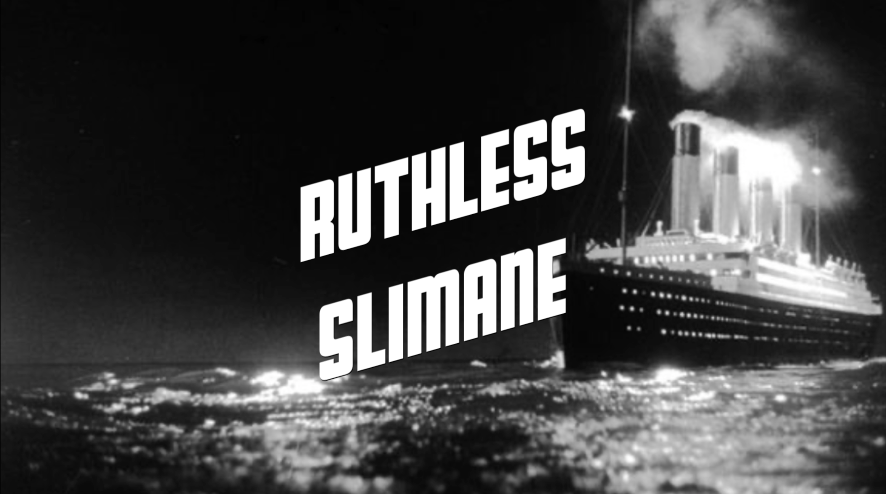

# Bourgau Film's

## Présentation

_Bourgau Film’s_ a été créé le 20 avril 2019 par Noah Bourgau à La Celle St Cloud en France. _Bourgau Film’s_ a réalisé son premier film « La conduite Volée » le 21 avril 2019. C’est un film de cambriolage de voiture où une jeune fille va résoudre seule l’enquête. Le nom original de ce studio est «_Bourgau Film’s Studios_», très vite raccourci par le nom de « _Bourgau Film’s_ ».
Si vous voulez avoir une vue de nos films, vous pouvez aller dans la page "bandes annonces" ou vous y trouverez les bandes annonces des différents films déja réalisés. 
Aussi, vous pouvez aller vister notre chaîne Youtube et y voir nos dessins-animés "Tiago et Roméo" en cliquant sur le liens ci-dessous. 

[Notre chaîne Youtube](https://www.youtube.com/channel/UCJlcDHQKwoStAThGKNaWd3A)

## Membres 

Aujourd'hui, Noah Bourgau, Julie Bourgau et Grégoire Vangraefschepe sont des membres de _Bourgau Film's_ et réalisent au quotidien différentes scènes des films en cour de réalisation. Ils sont tous les trois très heureux de voir que _Bourgau Film's_ évolue jours après jours grâce à vous. 

## Nos films
Pour avoir un aperçu de chaque film, vous pouvez regarder les bandes-annonces en cliquant sur les images ci-jointes.  

### La Conduite Volée

Terminée le 21 avril 2019, La Conduite Volée est le premier film que nous avons réalisé.

### Lapiness

Sortie le 6 juillet 2019, c'est un film où une méchante sorcière s'empare d'un lapin et d'un scooter à l'aide de son sac magique. 

### Pongo Berger

Lui aussi sorti en fin Juillet 2019, c'est l'histoire de la jalousie d'un berger pour un chien surdoué pour garder les moutons. Il va tout tenter pour le voler !!!

### Troisième Tentative 001

Troisième Tentative 001 est un film d'espionnage, de crimes et de cambriolages. Il est sorti le 22 Décembre 2019 et sa première représentation est prévue le 25 de ce mois.  

[Faire le quiz](https://bourgau-films.github.io/Quiz-Troisieme-tentative-001/)

### Ruthless Slimane

Ruthless Slimane est un film de magie. N'étant pas encore sorti, ce film est prévu pour Mai 2020. 

##### Bande-annonce indisponible

## Se procurer nos films

Si vous voulez vous procurer un de nos films, vous pouvez nous demander une de nos clés USB gratuitement en vous rendant dans une de nos représentations dans les cinémas [_Bourgau Ciné'_](https://bourgau-films.github.io/Bourgau-Cine/).

   Vous pouvez aussi nous faire un don pour que _Bourgau Film's_ puisse s'acheter du matériel ou améliorer ses techniques. 

## Ce qui pourrait vous interresser

[1jour1actu-petite histoire du cinéma](https://www.1jour1actu.com/info-animee/qui-a-invente-le-cinema/)

[C'est pas sorcier-la magie des effets spéciaux](https://www.youtube.com/watch?v=xo3nJ6geylU)

[C'est pas sorcier-silence on tourne](https://www.youtube.com/watch?v=4F85-sODG48)

   Nous espérons que ces vidéos vous ont plu et qu'elles vous ont appris des choses.
   
# Espace Agenda

## Tournages

Date | Horaires
---- | --------
/ | /

## Événements 

**Aucun événements prévus**

# Merci et à bientôt sur Bourgau Film's !!!

